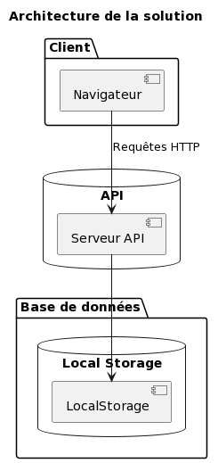

= Sushi Shop
:author: Tabar Labonne Baptiste et Laroui Chakib
:docdate: 2023-03-30
:description: Projet SushiShop
:toc: left
:toclevels: 5

== Présentation
Ce projet consiste en une application front-end pour la prise de commande au niveau d'un point de vente de sushis. Elle utilise le framework Angular et une API existante pour présenter la gamme de produits à la vente.

== Fonctionnalités
L'application permet à un utilisateur de passer commande de boxes de sushis en vue d'établir une commande transmissible à la production (cuisine). Voici les fonctionnalités implémentées dans ce projet :

- Une page "home" présentant le projet.
- Une page "produit" qui affiche tous les box dans l'API.
- Pour chaque box, un bouton permet de voir les détails de la box (page détail).
- Dans la page détail, un bouton permet de mettre une box dans notre panier (page panier).
- Dans la page panier, un bouton permet de commander (en théorie) les boxes.
- Accès à l'historique de nos commandes

== Utilisation

====
Sur la page d'acceuil "Produits", vous verrez la liste des boxes de sushis disponibles à la vente. Pour voir les détails d'une box, cliquez sur le bouton "Voir les détails" correspondant.

====

====
Sur la page "Détails", vous verrez les informations détaillées de la box de sushis sélectionnée. Vous pourrez également ajouter cette box à votre panier en cliquant sur le bouton "Ajouter au panier".

====

====
Sur la page "Panier", vous verrez la liste des boxes de sushis que vous avez ajoutée à votre panier. Vous pourrez également passer votre commande (en théorie) en cliquant sur le bouton "Valider la commande".

====

====
Enfin, vous pourrez accéder à l'historique de vos commandes en cliquant sur "Historique" dans la barre de navigation. (affichage à finaliser)

====

== Codes
=== Produits

=== Détails

=== Panier

=== Valider la commande

=== Service API

=== Service panier

=== App Routing

=== Box model
image:img/model.JPG[]

=== Produit (box) HTML

=== Détails (box) HTML

=== Environnement API

=== Code de l'API

Ces fonctions sont des endpoints d'une API REST en Kotlin qui sert à fournir des données et des images aux clients.

- allBoxes() renvoie toutes les boîtes stockées en base de données sous forme de liste d'objets de type BoxDtoJson.
- getImage() récupère une image stockée dans le dossier "static/images" à partir de son nom d'image et renvoie la ressource correspondante avec un type de contenu image/jpeg.
- getBoxById() renvoie une boîte stockée en base de données à partir de son ID sous forme d'un objet BoxDtoJson. Si la boîte est introuvable, elle renvoie une réponse avec le statut "notFound()".

== Diagramme
=== Diagramme d'utilisation

=== Diagramme des tiers

== Structure JSON
[source,json]
====
[source,json]
----
{
  "items": [
    {
      "id": 1,
      "date": 02/04/2023
      "name": "SushiBox1",
      "pieces": 6,
      "quantity": 2
    },
    {
      "id": 2,
      "date": 05/04/2023
      "name": "SushiBox2",
      "pieces": 8,
      "quantity": 1
    }
  ]
  "nomClient": "Jean Makoumè",
  "adresseLivraison": "15 Rue de la Paix, Paris",
  "telephone": "01 23 45 67 89",
  "montantTotal": 60
}
----
====

== Cybersécurité
Liste d'événements redoutés pour mon projet de site de vente de sushi :

1. Vol de données personnelles des clients tels que noms, adresses, numéros de téléphone et de cartes bancaires.
2. Attaque par déni de service (DDoS) empêchant les clients d'accéder au site et de passer des commandes.
3. Injection de code malveillant (malware) dans le site Web, pouvant permettre à des pirates informatiques d'intercepter les informations de paiement des clients.
4. Attaque de phishing, où les clients peuvent recevoir des e-mails frauduleux leur demandant de fournir des informations de compte ou de paiement.

Contre-mesures (EvilUS) pour ces événements redoutés :

1. Utilisation de pratiques de sécurité appropriées pour protéger les données des clients, telles que le cryptage des données stockées et la mise en œuvre d'une politique de mot de passe fort.
2. Mise en place de mesures de sécurité pour prévenir les attaques DDoS, telles que l'utilisation d'un pare-feu et la surveillance de la bande passante pour détecter les pics de trafic suspects.
3. Mise à jour régulière du logiciel et des systèmes d'exploitation pour prévenir les vulnérabilités connues qui pourraient être exploitées par les pirates informatiques.
4. Sensibilisation des clients aux techniques de phishing et fourniture d'informations claires sur les pratiques de sécurité du site pour éviter les fraudes.

== Conclusion
En conclusion, la réalisation de ce projet nous a permis de développer nos compétences en Angular et en développement web. Nous avons appris à concevoir une application d'e-commerce, à créer des composants et à les intégrer dans un système fonctionnel. Nous avons également amélioré nos compétences en matière de design et de développement d'interfaces utilisateur conviviales.

Ce projet nous a également permis de mettre en pratique des concepts clés tels que la gestion des états, l'utilisation des services, l'interaction avec des API externes et la persistance des données avec le LocalStorage.

Nous sommes assez fier du résultat final et nous espérons que cette application pourra être utilisée comme une référence pour les futurs projets de développement web que nous réaliserons.

== Technologies utilisées
Angular 13,
TypeScript,
HTML/CSS,
Bootstrap,
RxJS.

== Contributeurs
TABAR LABONNE Baptiste, LAROUI Chakib